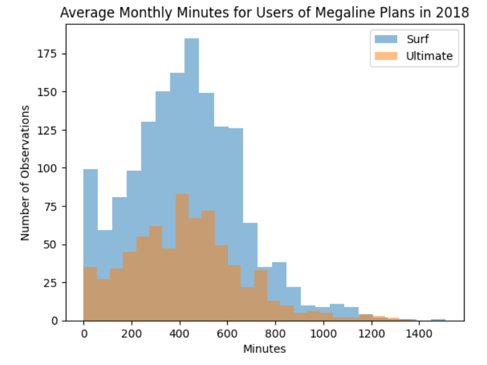
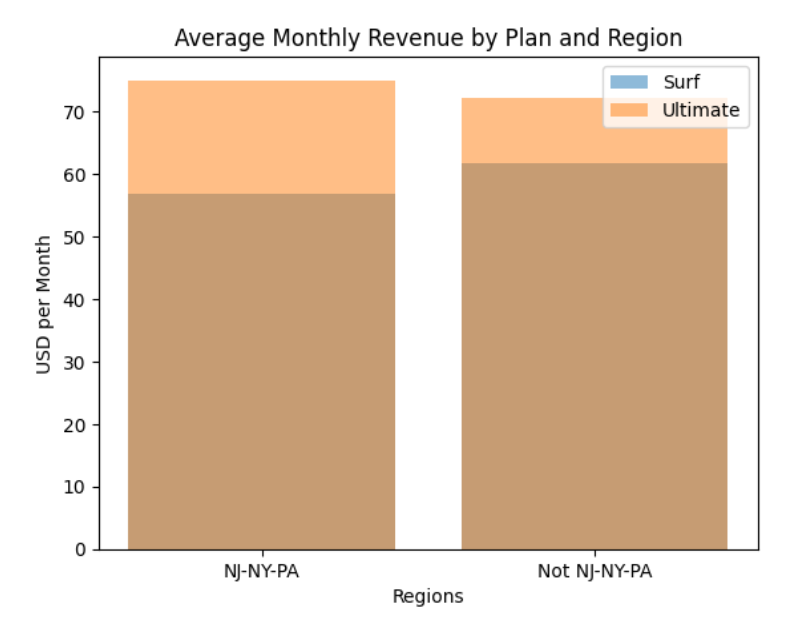

# Sprint 3 Project: Statistical Data Analysis

---

### 📚 Table of Contents
- 🔍 [Project Overview](#project-overview)
- 📈 [Conclusion](#conclusion)
- 🖼️ [Sample Outputs](#sample-outputs)
- 📁 [Files](#files)

---

## Project Overview

You work as an analyst for the telecom operator Megaline. The company offers its clients two prepaid plans, Surf and Ultimate. The commercial department wants to know which of the plans brings in more revenue in order to adjust the advertising budget. 

You are going to carry out a preliminary analysis of the plans based on a relatively small client selection. You'll have the data on 500 Megaline clients: who the clients are, where they're from, which plan they use, and the number of calls they made and text messages they sent in 2018. Your job is to analyze clients' behavior and determine which prepaid plan brings in more revenue. 

---

## Conclusion

The biggest assumption I made was assuming the data in the dataset was a representative sample of the population of Megaline users. It contained data on 137,735 calls, 76,051 messages, and 104,825 internet sessions but only from 500 users across 2,293 user-months, which is a relatively small sample. Some users neglected to make calls, send messages, or use the internet on some months, which is perfectly normal. Ten users showed no activity in any month and were thus excluded from the analysis. I was also assuming data from 2018 was relevant for user behavior in the future, that nothing about the plans or users has changed significantly in the interim. My decisions to assume variance was equal or not for the t-tests was based on my subjective judgment of variance differences without running any formal tests to check their validity. In the end, those decisions did not affect the general conclusions. Finally, I assumed the questions asked about monthly call duration and the NY-NJ region were pertinent to the task without exploring time or region beyond them.

There were no significant differences in behavior between plans regarding average monthly minutes and internet usage, but Surf plan users sent fewer messages and generated less revenue than Ultimate plan users. Messaging behavior aside, I think revenue difference derive mostly from plan pricing. The base monthly price for Ultimate plans is so much higher than that for Surf plans ($70 vs $20) that it makes up for the fact that extremely few Ultimate plan users exceed their allotted minutes, messages, and internet usage. Advertising should push the Ultimate plan when possible to maximize revenue, perhaps emphasizing that most Ultimate plan users never have to pay more than the base price. Increasing the base price of Surf plans or decreasing the allotted usage for Ultimate plans might also be worth considering to increase revenue.

Phone call duration was very low for Surf plan users during January and spiked during February, so it might make sense to advertise them more heavily in January to increase call duration and lock in as many users as possible for the peak in February. Call duration was low for Ultimate plan users before April, so it might make sense for the same reasons to advertise those plans more heavily early in the year, particularly in March (when call duration was lowest).

The NJ-NY-PA region was significantly less lucrative than other areas but the difference was fairly small. It might be worth increassing advertising in that area, especially for Ultimate plans because their revenue advantage over Surf plans was particularly pronounced there.

In conclusion, when it comes to revenue, the Ultimate plan is generally better for business.

---

## Sample Outputs

Here are two key moments from the analysis:

  
*Histogram comparing average monthly call durations for Surf and Ultimate plan users in 2018.*

 

  
*Bar plot comparing average monthly revenue for Surf and Ultimate plans, split by region.*

---

## Files

📄 See the full analysis in [`sprint-03-project.ipynb`](./sprint-03-project.ipynb)  
📄 Or view a static version in [`sprint-03-project.html`](./sprint-03-project.html)  
📄 Project background: [`project-description.md`](./project-description.md)

> Note: This project uses five CSV files, all of which are included in the `/data/` folder.  
> See [`/data/README.md`](./data/README.md) for details.
